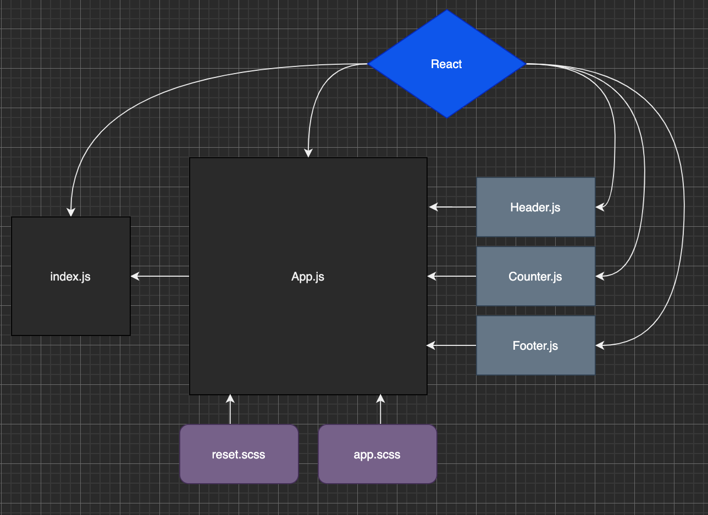

# Lab 21 - Component Based UI
## Author: Clayton Jones

## How to run
* Navigate to the Code Sandbox link below
* Use the `Plus` and `Minus` buttons on either side of the counter to change the value displayed.
* Alternatively, you may manually enter a value in the field given.

[Code Sandbox](https://codesandbox.io/embed/cf-lab-21-z1usc?fontsize=14&hidenavigation=1&theme=dark)

